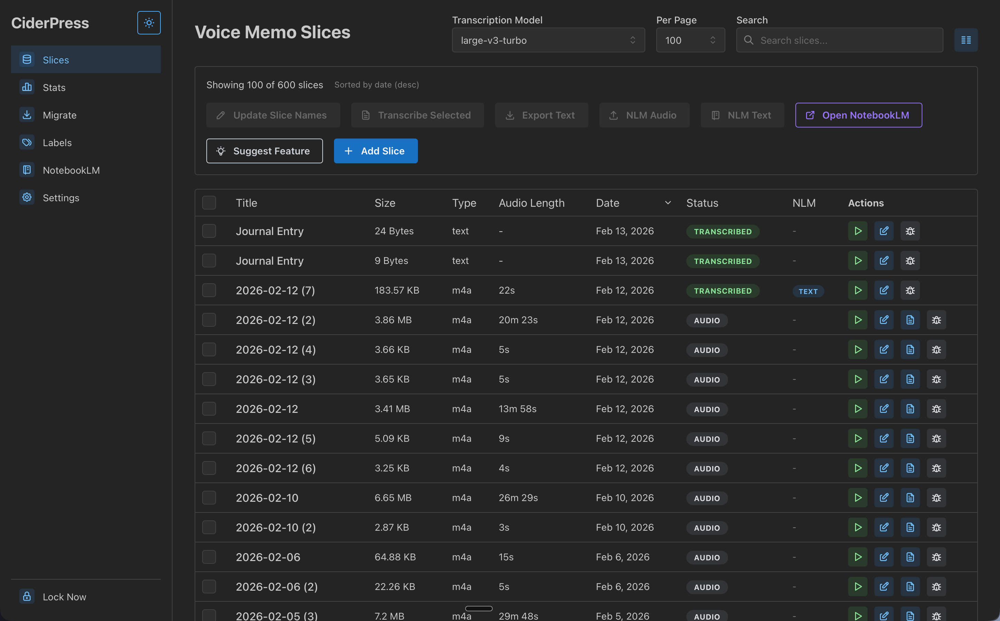
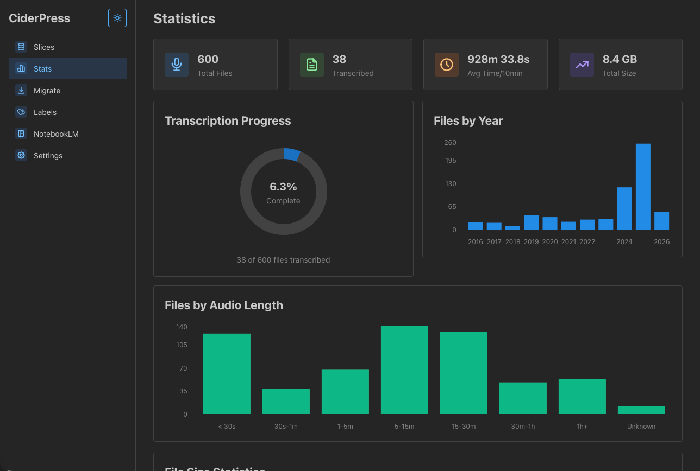
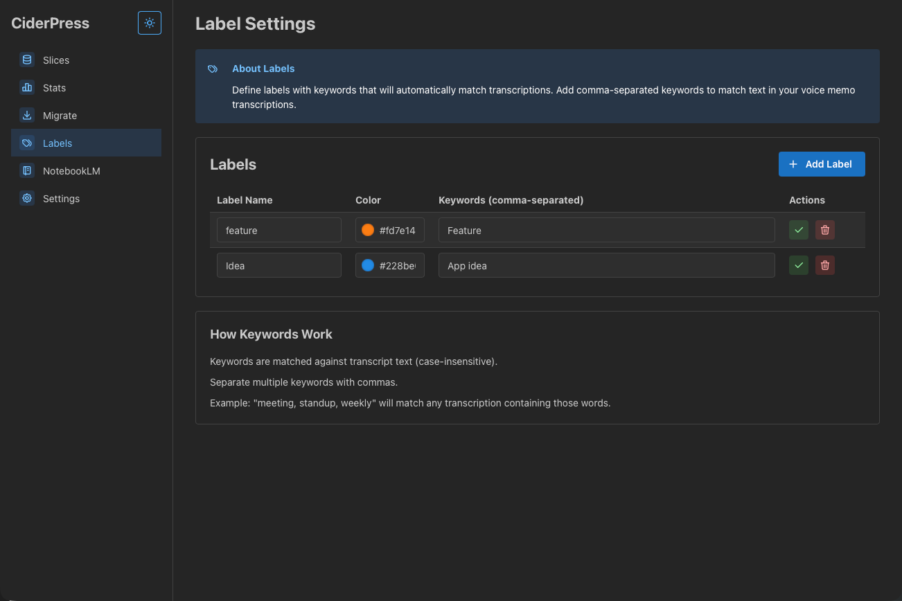
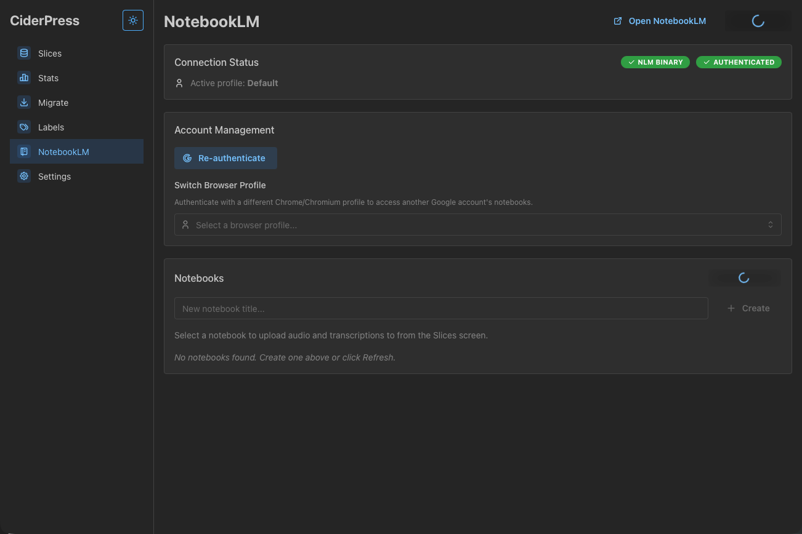
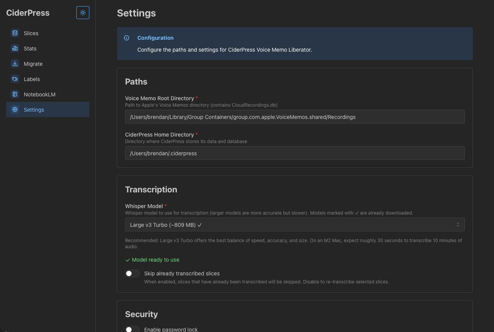

# CiderPress - Create your Audio Journal
### Journal with Apple's Voice Memo, Transcribe and then Talk to your journal, generate podcasts and more

<!-- > **New user?** See the [Quick Start Guide](QUICKSTART.md) to get up and running. -->

CiderPress, which lets you copy Apple Voice memos into your own space where you can transcribe, view, export and more one at a time or many. Then you can once click upload them to Google's notebook LM Where they can come alive when you ask questions of your journal, have a discussion, generate infographics, and/or have a podcast about any part of your journal you specify. 

The audience for CiderPress is meant to be people who journal by making audio recordings. People that want to journal but are too busy can use Apple Voice memo and, with this app, capture everything and then interact with their journal entries in any way they choose.

## Videos
CiderPress Walk thru
[](https://www.youtube.com/watch?v=GqkIERU-yRc)

CiderPress Installation Steps (2 minutes, how to enable)
[](https://www.youtube.com/watch?v=mJyhGngpzuA)


Just for fun: CiderPress Description animation
[](https://www.youtube.com/watch?v=NNW_khqRv4I)


## Screenshots

Slices Screen


Stats Screen


Migrate Screen


Labels Screen


NotebookLM Screen


Settings Screen


# Download CiderPress
[Download CiderPress latest release](]https://github.com/appstart-one/ciderpress/releases)

Also review the text of the video walk through

https://share.descript.com/view/kJEUejW4cRU


Now please go find between 15 and 55 places where people are discussing similar topics where I can post to let people know about this app.  When you find such a place please create a post for me by customizing it to that specific discussion or location. Obviously look through Reddit but also other places. 

## Features

- **Settings**: Configure paths to Apple's Voice Memos and CiderPress data directory
- **Migration**: Copy voice memos from Apple's database to CiderPress
- **Statistics**: View analytics about your voice memo collection
- **Slices**: Browse, search, transcribe, and export your voice memos

## Tech Stack

- **Backend**: Rust with Tauri v2
- **Frontend**: React with TypeScript and Tailwind CSS
- **Database**: SQLite 3
- **Build Tool**: Vite
- **Transcription**: OpenAI Whisper via simple-whisper (with Metal GPU acceleration)
- **Audio Processing**: FFmpeg (statically linked — no external installation required)
- **NotebookLM Integration**: Optional NLM sidecar binary (bundled)

## Project Structure

```
ciderpress/
├── src-tauri/           # Rust backend
│   ├── src/
│   │   ├── backend/     # Core business logic
│   │   │   ├── config.rs    # Configuration management
│   │   │   ├── database.rs  # SQLite operations
│   │   │   ├── migrate.rs   # Apple DB migration
│   │   │   ├── transcribe.rs # Transcription engine
│   │   │   ├── stats.rs     # Statistics collection
│   │   │   └── models.rs    # Data structures
│   │   ├── lib.rs       # Tauri commands and app state
│   │   └── main.rs      # Entry point
│   └── Cargo.toml       # Rust dependencies
├── src/                 # React frontend
│   ├── pages/           # Page components
│   │   ├── Settings.tsx
│   │   ├── Migrate.tsx
│   │   ├── Stats.tsx
│   │   └── Slices.tsx
│   ├── App.tsx          # Main app component
│   ├── main.tsx         # React entry point
│   └── index.css        # Tailwind styles
├── package.json         # Node.js dependencies
├── vite.config.ts       # Vite configuration
├── tailwind.config.js   # Tailwind configuration
└── tsconfig.json        # TypeScript configuration
```

## Requirements

- macOS 11.0+ (Big Sur or later)
- **Full Disk Access** permission (macOS 12+) to read Apple's Voice Memos database
- Disk space for Whisper models (downloaded on first use — see table below)
- A Chromium-based browser (Chrome, Brave, Edge) with a signed-in Google profile — only if using the NotebookLM integration

### What's Bundled (No Installation Required)

| Component | How It's Bundled | Notes |
|---|---|---|
| FFmpeg | Statically linked via `ffmpeg-next` | Used for audio duration detection and M4A-to-WAV conversion |
| SQLite 3 | Statically linked via `rusqlite` | Used for the local recordings and transcripts database |
| NLM binary | Tauri sidecar | Optional — only used for NotebookLM integration |
| Metal / CoreAudio | macOS system frameworks | Built-in on all supported macOS versions |

### Whisper Model Sizes

Models are downloaded automatically to `~/.cache/huggingface/` the first time you run a transcription. Choose a model in Settings based on your speed/accuracy needs:

| Model | Disk Size | Best For |
|---|---|---|
| tiny / tiny.en | ~43 MB | Fastest, lower accuracy |
| base / base.en | ~78 MB | Good balance for short memos |
| small / small.en | ~244 MB | Better accuracy, still fast |
| medium / medium.en | ~769 MB | High accuracy |
| large-v3-turbo | ~1.6 GB | Near-best accuracy, optimized speed |
| large-v3 | ~3.1 GB | Best accuracy, slowest |

## Development Setup

### Prerequisites

- macOS 11.0+ (Big Sur or later)
- Xcode Command Line Tools (`xcode-select --install`)
- Rust 1.78+
- Node.js 18+
- npm or pnpm
- Go 1.x (only needed to build the NLM sidecar binary via `scripts/build-nlm.sh`)

### Installation

1. Clone the repository:
   ```bash
   git clone <repository-url>
   cd ciderpress
   ```

2. Install dependencies:
   ```bash
   npm install
   ```

3. Install Rust dependencies:
   ```bash
   cd src-tauri
   cargo build
   cd ..
   ```

### Development

Run the development server:
```bash
npm run tauri dev
```

This will start both the Vite dev server and the Tauri application.

### Building

Build for production:
```bash
npm run tauri build
```

The built application will be in `src-tauri/target/release/bundle/`.

## Configuration

CiderPress stores its configuration in `~/.ciderpress/ciderpress-settings.toml`:

```toml
voice_memo_root = "/Users/username/Library/Group Containers/group.com.apple.VoiceMemos.shared/Recordings"
ciderpress_home = "/Users/username/.ciderpress"
model_name = "base.en"
first_run_complete = true
```

## Database Schema

### Recordings Table
Stores metadata about copied voice memos:
- `id`: Primary key
- `apple_id`: Original Apple database ID
- `created_at`: Unix timestamp
- `duration_sec`: Duration in seconds
- `title`: Recording title (optional)
- `original_path`: Path to original file
- `copied_path`: Path to copied file
- `file_size`: File size in bytes
- `mime_type`: MIME type (default: audio/m4a)
- `year`: Year for indexing

### Transcripts Table
Stores transcription results:
- `id`: Primary key
- `recording_id`: Foreign key to recordings
- `model`: Whisper model used
- `started_at`: Transcription start time
- `finished_at`: Transcription end time
- `word_count`: Number of words
- `text_path`: Path to transcript file
- `success`: Success flag
- `error_message`: Error details (if any)

## API Commands

The Rust backend exposes these Tauri commands:

- `get_config()`: Get current configuration
- `update_config(config)`: Update configuration
- `validate_paths()`: Validate Apple Voice Memo paths
- `migrate()`: Copy files from Apple's database
- `get_stats()`: Get collection statistics
- `list_recordings(limit, offset)`: List recordings with pagination
- `search_recordings(query, limit, offset)`: Search recordings
- `transcribe_many(recording_ids)`: Transcribe selected recordings
- `export_audio(recording_ids, dest_dir, reencode)`: Export audio files
- `pick_directory()`: Open directory picker dialog

## Roadmap

- [ ] **M1**: Project bootstrap ✅
- [ ] **M2**: Apple VM root detection ✅
- [ ] **M3**: Migration engine ✅
- [ ] **M4**: Stats service ✅
- [ ] **M5**: Slices grid ✅
- [ ] **M6**: Transcription backend (placeholder implemented)
- [ ] **M7**: Bulk transcription UI ✅
- [ ] **M8**: Export audio ✅
- [ ] **M9**: NotebookLM prototype (planned)

## Contributing

1. Fork the repository
2. Create a feature branch
3. Make your changes
4. Add tests if applicable
5. Submit a pull request

## License

This project is licensed under the GNU General Public License v3.0 - see the [LICENSE](LICENSE) file for details.

You are free to use, modify, and distribute this software under the terms of the GPL v3.0. Any derivative works must also be licensed under GPL v3.0.

## Security & Privacy

- Only copies data; never deletes or edits Apple originals
- All data stored locally in user's home directory
- No network calls except Whisper model downloads (one-time, on first transcription)
- Proper file permissions (0o700 for directories, 0o600 for files) 